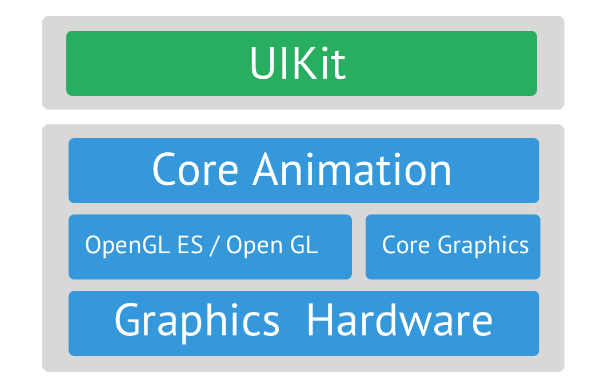
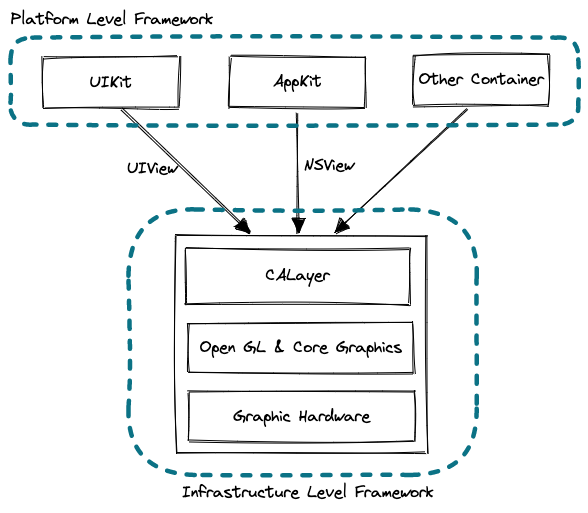

### clipToBounds vs. maskToBounds

```Swift
self.view.clipToBounds = true // UIView
// or
self.view.layer.maskToBounds = true // CALayer
```

위의 두 코드는 View의 cornerRadius 를 적용하고 하위 View 에도 동일하게 적용시킬 때 사용되곤한다.
실제도 두 코드 중 어느 것을 선택하더라도 모두 동일한 결과를 얻게 된다.

동일한 동작을 한다면 `clipToBounds` 와 `maskToBounds` 의 차이는 무엇이고 왜 두 가지 방법을 모두 제공할까?

### clipToBounds == maskToBounds

[이 글](https://stackoverflow.com/questions/1177775/how-is-the-relation-between-uiviews-clipstobounds-and-calayers-maskstobounds/1177978#1177978)에 따르면 어셈블리 코드 레벨에서 `clipToBounds` 의 호출 흐름을 따라가보면 `maskToBounds` 호출한다는 것을 보여준다. 결국 `clipToBounds` 와 `maskToBounds` 의 차이는 기능적으로 동일하지만 맥락에 따른 용어적인 차이라고 저자는 말한다.

`clipToBounds` 는 UIView 클래스의 인스턴스 속성이고 `maskToBounds` 는 CALayer 의 인스턴스 속성이다. 그리고 `clipToBounds` 가 내부적으로 `maskToBounds` 를 호출한다면 UIView 와 CALayer 는 어떤 협력 관계일까?

### UIView & CALayer

[애플 문서](https://developer.apple.com/documentation/uikit/uiview)에 따르면 UIView 는 크게 다음의 3 가지 역할을 하는 객체라고 설명한다.

1. 애니메이션과 화면 그리기
2. 레이아웃과 하위 View 관리
3. 탭, 드래그 등의 인터렉션 처리

UIView 와 CALayer 의 관계는 1번 역할과 관련이 있다. UIView 에는 화면을 그리는 동작과 관련된 여러 메소드를 제공하고 있다. 개발자가 직접 override 를 통해 이 동작은 커스텀할 수도 있다.

> 이 때문에 UIView 와 CALayer 는 각자 UI 요소를 그리는 개별 메커니즘을 가지고 있고 View 와 Layer 라는 요소가 화면에 함께 그려지는 것이라고 생각했었다.

그러나 실제로 View 컨텐츠를 그리는 동작은 CALayer 를 통해서 이루어진다. UIView 는 CALayer 가 컨텐츠를 그리는대 필요한 것을 제공해주는 역할하는 Wrapper/Container 이다.

(물론 더 깊이 들어가면, CALayer 또한 Wrapper 역할을 하고 Core Graphics, Open GL 이 실제로 그래픽 하드웨어를 컨트롤해 컨텐츠를 그린다고 한다.)

그렇다면 애플은 어째서 UIView 자체적으로 컨텐츠를 그리도록 구현하지 않고 CALayer 와 협력하게 만든 것일까?

### UI Framework


고전 동화 피노키오에 나오는 제페토 할아버지를 떠올려보자.

화가 인형을 만든 제페토 할아버지는 이 인형으로 인형극을 하고 싶었다. 그런대 인형을 직접 손에 쥐고 움직이는 일이 불편하고 조작하기 쉽지 않다고 느꼈다. 그래서 인형의 양 팔에 실을 매달아 손을 쉽게 움직일 수 있게 만들었다.

이전 보다 조작하기 쉬워졌지만 더 복잡한 움직임을 위해 실을 추가로 매달자 여러 실을 조작하는 일도 불편하게만 느껴졌다. 그래서 할아버지는 실들을 나무에 매달아 조작하는 컨트롤러를 만들었다. 이 조차 금방 불편함을 느낀 할아버지는 인형에 생명을 불어 넣어 스스로 움직이는 피노키오를 만들어냈다.



제페토 할아버지 이야기는 애플 framework 의 발전 과정과 비슷하다.

직접 화면에 컨텐츠를 그리는 하드웨어(화가 인형)를 조작하기 위해서 Open GL, Core Graphics(인형에 매달린 실)가 만들어졌다. 저수준의 프래임워크를 통해 하드웨어를 직접 조작하기에 복잡한 화면을 구현할 수 있고 성능도 뛰어나다는 장점이 있다. 그러나 간단한 작업에도 작성해야할 코드량이 많다는 단점이 존재했다. 이를 보완하고 간편한 사용을 위해 Core Animation(나무 컨트롤러) 가 만들어졌고 이후에는 보다 개선된 UIKit(피노키오) 가 등장했다.

이 이야기의 핵심은 다음과 같다.

1. 사용이 어렵고 복잡한 저수준의 프래임워크를 기반으로 보다 <ins>**_사용하기 쉬운_**</ins> 고수준 프래임워크를 만들어냈다는 점
2. 고수준의 프래임워크는 내부적으로는 <ins>**_저수준 프래임워크에 의존_**</ins> 한다는 점
3. 고수준 프래임워크로 갈수록 <ins>**_저수준 프래임워크에 대한 컨트롤이 제한_**</ins> 된다는 점

다시 UIView 와 CALayer 로 돌아오면, UIView 는 많은 코드량을 요구하지만 복잡한 UI 를 만들 수 있고 저수준의 좋은 성능을 누릴 수 있는 CALayer 를 내부적으로 사용한다. 동시에 CALayer 의 모든 기능을 제공할 수는 없기에 제한된 범위내에서 CALayer 의 기능을 개발자가 손 쉽게 사용하도록 메소드와 속성으로 제공한다.

### 내 생각

`clipToBounds` 가 별도로 제공되는 이유는 저수준 API 의 손 쉬운 사용과 View 를 다루는대 있어 중요한 개념인 frame 과 bounds 과 깊은 관련이 있기 때문이라고 추측해본다.

또한 layer(`self.view.layer`) 속성을 제공해 저수준 API 를 사용에 대한 선택권을 주고 UIView 를 가지고도 복잡한 UI 를 그릴 수 있는 가능성을 열어준 거라고 생각한다.

더욱이 CALayer 가 iOS의 UIKit 뿐만아니라 MacOS의 AppKit 적용되어있다는 사실을 알게되었다. 공통된 기반 위에 각 OS 플랫폼에 맞는 Container framework 만 구현하면, 모든 플랫폼이 동일한 설계를 기반으로 만들어지기 때문에 유지보수하기 쉬워지고 기능이 업데이트되면 모든 플랫폼에서 사용할 수 있을 것 같다는 생각이 들었다. 애플 제품간 연동 기능도 이러한 설계 기반이 있기에 가능한 것이 아닐까? 라고 조심스럽게 추측해본다.



### 참고자료

[UIView - Apple Official Document](https://developer.apple.com/documentation/uikit/uiview)

[How does clipsToBounds work?](https://stackoverflow.com/questions/20449256/how-does-clipstobounds-work/20449468#20449468)

[What are the differences between a UIView and a CALayer?](https://stackoverflow.com/questions/7826306/what-are-the-differences-between-a-uiview-and-a-calayer/7827488#7827488)

[How is the relation between UIView's clipsToBounds and CALayer's masksToBounds?](https://stackoverflow.com/questions/1177775/how-is-the-relation-between-uiviews-clipstobounds-and-calayers-maskstobounds/1177978#1177978)

[When to use CALayer on the Mac/iPhone?](https://stackoverflow.com/questions/1447598/when-to-use-calayer-on-the-mac-iphone/1449201#1449201)

[iOS) Views vs Layers](https://velog.io/@songtaehwan/iOS-Views-vs-Layers)
