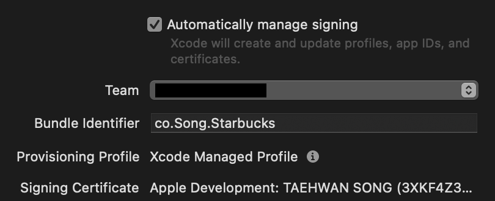
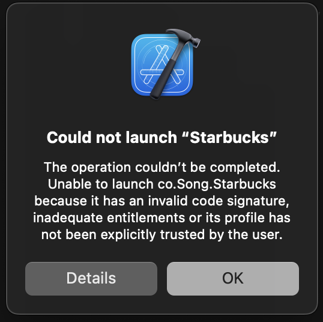
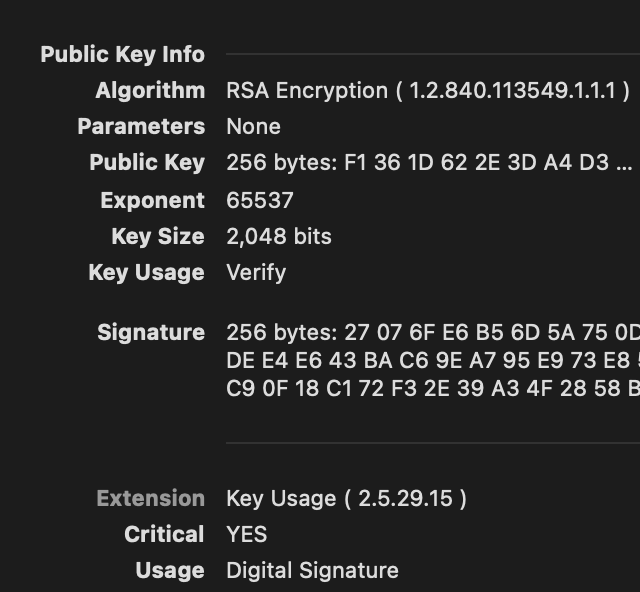
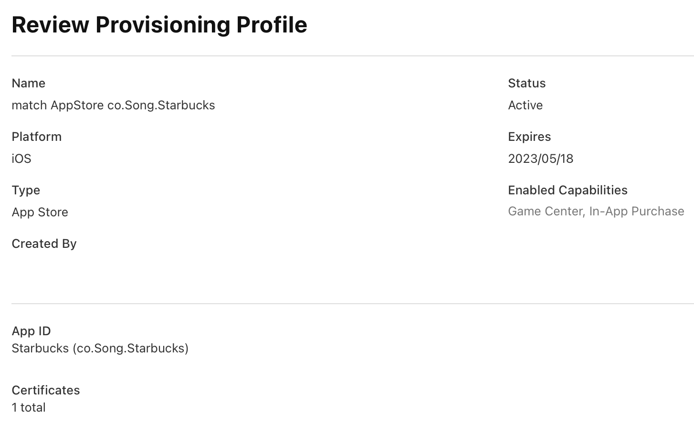

처음으로 Xcode 에서 앱을 빌드하거나 배포를 위해 Archive 를 할 때 `Code Signing`에 대해 고민하게 될 것이다.
`Code Signing` 이 무엇이고 왜 필요한지 알아보자.

목차는 다음과 같다.

1. Code Signing
2. Signing Certificate
3. Provisioning Profile
4. TL;DR

## Code Signing

> Code signing your app assures users that it's from a known source and hasn’t been modified since it was last signed.
> Before your app can integrate app services, be installed on a device, or be submitted to the App Store, it must be signed with a certificate issued by Apple.

애플 문서에 따르면 사용자에게 앱이 서명된 이후로 변경되지 않았음을 증명하고 기기에 설치하거나 앱 스토어에 제출하기 전에 **반드시** 애플로부터 발급받은 인증서와 함께 서명해야한다고 언급되어 있다.

앱을 서명한다는 말이 무슨 뜻일까?

계약서에 서명해본 적이 있다면 이해하기 쉬울 것이다. 예를 들어, 새 휴대폰을 할부로 구매한다고 가정해보자. 계약서를 작성 및 본인의 서명을 하고 휴대폰을 받음으로써 계약이 완료된다.
이때 계약서의 서명은 계약서에 제시된 조건과 내용을 인정하고 동의한다는 의미로 작성된다. 또한 계약이 완료된 시점으로부터 양측 계약 당사자 모두 **법적으로 인정과 보호**를 받는다. 이렇게 작성된 계약서는 계약 당사자 한 쪽이 마음대로 **내용을 바꾸더라도 법적으로 인정받지 못하고** 처벌을 받게 된다.

여기서 기억해야할 것은 두 가지이다.

1. `계약서`에 서명 후 마음대로 수정할 수 없다.
2. 서명된 `계약서`은 `법`에 의해 인정받고 보호받는다.

`Code Signing` 도 계약서에 서명하는 것처럼 작성한 코드에 디지털 서명을 하는 것과 같다. 위에서 언급한 `계약서`는 `앱`으로, `법` 은 `애플`로 바뀌서 다시 읽어보자.
`Code Signing` 은 서명된 앱이 서명된 후로 변경되지 않았음을 애플로부터 증명받는 과정이다.

만약 앱 서명 이후에 어떠한 방법으로든 앱이 변조되면 앱스토어의 심사를 통하지 못하거나, 디바이스에서 실행되지 않는다. apk 파일만 있으면 설치하고 실행하는 문제가 없는 안드로이드를 떠올려보자. 요즘 보이스 피싱은 특정 앱을 인터넷에서 다운받아 설치하도록 유도하도 해당 앱을 통해 돈을 훔친다고 한다. `Code Signing` 덕분에 애플 기기에 악의적인 목적을 가진 앱으로부터 안전할 수 있다.

그렇다면 누가, 언제 앱 서명의 확인을 해야할 필요가 있는 걸까?

개발 중인 앱을 실제 기기에서 실행시킬 때 위의 문구를 보았을 것이다. 문구에 따르면 서명이 유효하지 않거나, 불충분한 entitlement 또는 프로파일이 사용자로부터 신뢰받지 못한 경우 앱을 실행할 수 없다고 한다.

<small style="color: gray;">\*Xcode 가 자동으로 생성해준 Certificate 를 사용함에도 위의 경고가 뜨는 이유는 주로 앱의 Provisioning profile 이 애플 개발자 포털에 등록되어 있지 않기 때문이다.</small>

코드 서명은 설치된 앱을 실행하거나 앱스토어에 제출할 때 디바이스나 애플에 의해 확인된다.

앱 서명은 어떤 과정과 방법으로 이루어질까?

## Signing Certificate

앱 서명은 Certificate 라는 인증서를 발급받아 사용하는 것으로 할 수 있다. Certificate 에는 디지털 서명뿐만아니라 발급 신청자와 발급한 기관에 대한 정보도 담겨있다.

> 계약서에 서명만 하면 됐지 다른건 왜 필요하지? 라는 의문이 들 수 있다.

다시 현실 세계로 돌아와 계약서를 떠올려보자. 계약서에 서명한 당사자가 본인이라면 문제가 없을 것이다. 그러나 이점을 악용하여 서명을 위조하는 경우도 존재한다. 실제로 계약 절차에는 서명 하는 사람의 본인 인증을 위해 주민등록증을 제시하고 사본을 복사하는 과정을 거친다. 주민등록증도 공문서의 일종으로 정부가 발급하기에 우리는 신분 확인에 제시되는 주민등록증을 신뢰할 수 있다.

특히나 디지털 세계에서는 얼굴을 맞대고 서명하는 것이 아니기 때문에 서명을 하는 사람에 대한 정보가 필요하고 해당 정보를 인증해줄 권위 있는 기관이 필요한 것이다. 쉽게 말해 디지털 신분증을 발급 받아야하는 것이다.

다행히도 애플이 서명이 포함된 디지털 신분증(Certificate)을 발급해주는 기관의 역할도 겸하고 있다. 이러한 기관을 CA(Certificate Authority) 라고 한다.

Certificate 내용에는 몇 가지 정보가 담겨있다.

1. 발급을 요청한 사람/기관
2. 인증서 발급 기관
3. 인증서 만료일
4. 서명
5. 인증서 사용 목적

인증서의 `Public Key Info` 부분에는 서명에 사용된 알고리즘에 대한 정보와 서명에 대한 정보를 확인할 수 있다.
또한 이미지 하단 `Usage` 부분에 Public key 를 디지털 서명에 사용할 수 있다고 용도가 표시되어있다. <small style="color: gray;">\*인증서 정보는 Mac 에 설치된 `Keychain Access` 앱을 통해 쉽게 확인할 수 있다.</small>

Certificate 발급은 `Keychain Access` 을 통해 만든 CSR(Certificate Signature Request) 을 애플 개발자 포털에 업로드하여 발급 받을 수 있다. <small style="color: gray;">\*애플 개발자 프로그램에 가입되어있어야 한다. 자세한 과정은 다음에 다뤄보기로 하겠다.</small>

애플을 통해 Certificate 를 발급 받았다면 사실상 Code Signing 에 필요한 서명은 준비가 된 것이다.

## App ID

앱 서명이 준비되었다면 서명할 앱에 대한 정보를 애플의 개발자 포털에서 등록해야한다.

앱을 등록하는 과정에서 해당 앱이 사용하는 다른 앱 서비스<small style="color: gray;">\*MusicKit, ShazamKit</small>와 애플에서 제공하는 기능<small style="color: gray;">\*애플 페이, iCloud, Maps, Push Notification 등</small> 에 대한 정보도 함께 등록해야한다.

다른 서비스에 대한 정보(Entitlement)를 포함 시켜야하는 이유는 해당 기능들은 다른 앱과 데이터를 공유하고 상호작용하기 때문에 `Code Signing` 프로세스와 통합되어있다. 악의적인 목적을 가진 앱으로부터 민감한 정보가 노출될 가능성을 보호하기 위한 조치이다.

예를 들어, 앱이 애플 페이를 사용하고 있음에도 해당 정보를 등록하지 않으면 앱스토어 심사에 걸려 등록되지 않는다.

## Provisioning Profile

Certificate 와 앱 등록을 마쳤다면 Provisioning Profile 을 만들 수 있다. Profile 에는 **App ID**, **Certificate**, 앱의 실행이 허용된 **Device**에 대한 정보와 앱이 사용하는 **Entitlement** 가 나열되어있다. 앱에 대한 신상명세서라고 볼 수 있다.

1. App ID
2. Certificate
3. Device
4. Entitlement

Xcode 를 통해 Provisioning Profile 을 등록하고 기기에 앱을 테스트하면 위에서 보았던 경고창은 더이상 나타나지 않을 것이다. 아카이브에 필요한 Code Signing 도 모두 준비된 셈이다.

## TL;DR

Code Signing 은 다음 4 가지 사항을 모두 포함한다.

1. 앱이 변조되지 않았음을 증명하기 위한 서명을 포함한다.
2. 서명에는 Certificate 가 사용되고 Certificate 는 애플로부터 발급받는다.
3. 애플 개발자 포털에 앱을 등록하고 Entitlement 에 대한 정보도 포함시켜야한다.
4. Provisioning Profile 에는 App ID, Certificate, 앱을 실행시킬 수 있는 Device 목록, Entitlement 정보가 포함된다.

### 참고자료

[Apple Official Document](https://developer.apple.com/support/code-signing/)

[The Basic of iOS Code Signing](https://michiganlabs.com/news/ios-code-signing)

[iOS Code Signing & Provisioning in a Nutshell](https://medium.com/ios-os-x-development/ios-code-signing-provisioning-in-a-nutshell-d5b247760bef)

[Overview of iOS app signing](https://youtu.be/0lJvQ-442OY)

[HTTPS 가 뭐고 왜 쓰나요?](https://youtu.be/H6lpFRpyl14)
